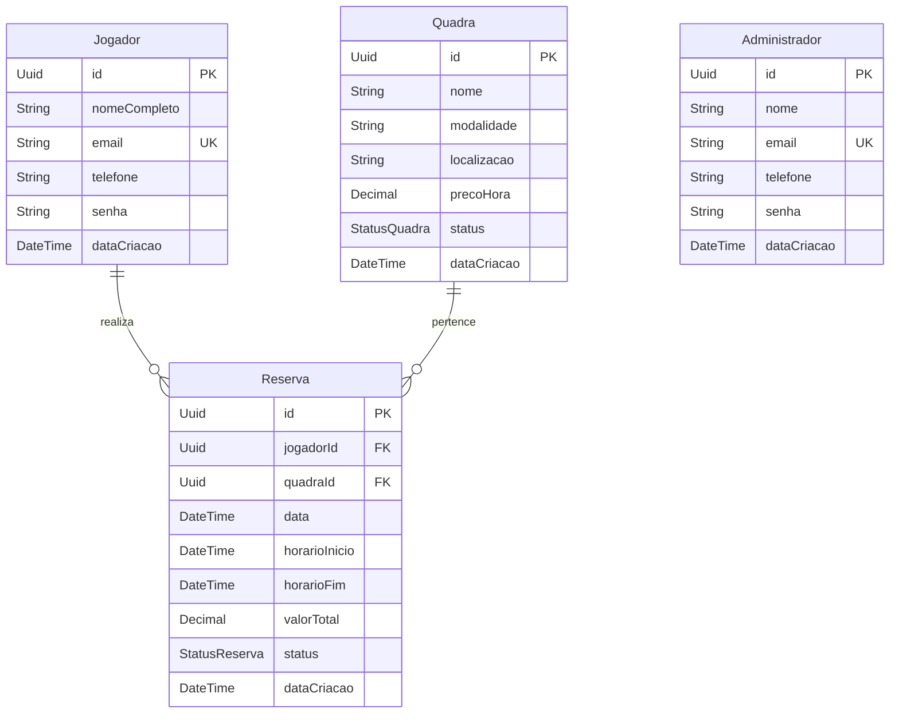

# 📚 Documentação Técnica — ArenaPlay (Agendamento de Quadras Esportivas)

**Projeto DFS-2026.2** — Requisito do Curso *Desenvolvimento Full Stack Básico* (Bootcamp Atlântico Avanti).

---

## 👨‍💻 Equipe de Desenvolvimento
- **Gabrielle Christie do Nascimento de Souza** — *Arquitetura Backend, Autenticação JWT, Motor de Reservas & Integração Frontend*
- **Hevlina Karoll Lima Reis** — *Design de Interface, Componentização React & Módulo de Quadras*
- **Fellipi Kainnan Candido de Lima** — *CRUD Backend (Quadras e Reservas), Testes de Integração, Regras de Validação & Documentação*

---

## 1. Visão Geral da Solução

O **ArenaPlay** é um sistema web Full Stack projetado para resolver a complexidade do agendamento manual de quadras esportivas. A plataforma conecta praticantes de esportes a donos/administradores de complexos esportivos, garantindo automação no controle de horários, prevenção contra reserva duplicada (overbooking) e transparência nas informações.

### 🎯 Objetivos Principais
- Prover uma **API RESTful** segura, escalável e tipada para gestão de entidades e reservas.
- Desenvolver uma interface **Single Page Application (SPA)** responsiva, intuitiva e moderna.
- Implementar um **motor de validação de horários** em tempo real para impedir sobreposição de agendamentos.
- Garantir segurança no controle de acesso através de **tokens JWT** e criptografia de senhas.

---

## 2. Arquitetura da Solução

A solução adota uma arquitetura desacoplada em duas camadas principais:

```text
[ Cliente React (SPA) ]  <--- HTTP/JSON + JWT --->  [ Backend Node.js / Express API ]
                                                               |
                                                          (Prisma ORM)
                                                               |
                                                       [ PostgreSQL DB ]
```

### 🧰 Stack Tecnológica Detalhada

#### **Backend**
* **Runtime:** Node.js (v18+)
* **Framework Web:** Express.js (v5)
* **ORM:** Prisma Client (com suporte a migrations e type-safety)
* **Banco de Dados:** PostgreSQL
* **Autenticação:** JSON Web Token (`jsonwebtoken`)
* **Segurança:** `bcryptjs` para hash de senhas e `cors` para controle de origem
* **Validação de Schemas:** `zod`
* **Testes de Integração:** Jest & Supertest

#### **Frontend**
* **Core:** React 18
* **Build Tool:** Vite
* **Estilização:** Tailwind CSS (com suporte a responsividade e utilitários modernos)
* **Navegação:** React Router DOM (v6)
* **Cliente HTTP:** Axios (com interceptors para injeção automática de token `Bearer`)
* **Iconografia:** Lucide React

---

## 3. Modelo de Dados & Relacionamentos

A camada de persistência é gerenciada via **Prisma ORM**, estruturada em quatro entidades e enums de estado.

### 📊 Diagrama Entidade-Relacionamento (ERD)



### 🔢 Enums do Sistema

- **`StatusQuadra`**: `DISPONIVEL` | `INDISPONIVEL` | `MANUTENCAO`
- **`StatusReserva`**: `ATIVA` | `CANCELADA` | `CONCLUIDA`

---

## 4. Regras de Negócio & Segurança

### 🛡️ Autenticação e Controle de Acesso (RBAC)
1. **Passwords:** Todas as senhas armazenadas passam por hashing com salt de fator 10 utilizando `bcryptjs`.
2. **Tokens JWT:** Emitidos no login contendo o `id`, `email` e perfil do usuário (`role`). Validade configurada por ambiente.
3. **Roles:**
   * `JOGADOR`: Permissão para visualizar quadras, realizar agendamentos próprios e cancelar suas reservas ativas.
   * `ADMIN`: Permissão irrestrita (CRUD de quadras, gestão de administradores e visualização global de reservas).

### ⚡ Motor Anti-Conflito de Reservas (`reservaUtils.js`)
O sistema executa uma consulta no banco antes de autorizar qualquer reserva para a mesma quadra no mesmo dia.

A colisão ocorre se o novo intervalo $[H_{\text{inicio}}^{\text{novo}}, H_{\text{fim}}^{\text{novo}}]$ interceptar qualquer reserva com status `ATIVA`:

$$\text{Conflito} \iff (H_{\text{inicio}}^{\text{novo}} < H_{\text{fim}}^{\text{existente}}) \land (H_{\text{fim}}^{\text{novo}} > H_{\text{inicio}}^{\text{existente}})$$

Se a condição for verdadeira, a requisição é rejeitada com código HTTP `400 Bad Request` informando o conflito.

---

## 5. Especificação dos Endpoints REST (API)

### 🔑 Autenticação (`/auth`)

| Método | Rota | Descrição | Status Sucesso | Auth |
|---|---|---|---|---|
| `POST` | `/auth/registrar` | Cadastra um novo jogador | `201 Created` | Pública |
| `POST` | `/auth/login` | Autentica e retorna Token JWT | `200 OK` | Pública |
| `GET` | `/auth/perfil` | Retorna os dados do usuário autenticado | `200 OK` | Bearer Token |

---

### 🏟️ Módulo de Quadras (`/quadras`)

| Método | Rota | Descrição | Status Sucesso | Auth |
|---|---|---|---|---|
| `GET` | `/quadras` | Lista quadras (aceita filtros por modalidade/status) | `200 OK` | Pública |
| `GET` | `/quadras/:id` | Retorna detalhes de uma quadra específica | `200 OK` | Pública |
| `POST` | `/quadras` | Cadastra uma nova quadra | `201 Created` | Admin |
| `PUT` | `/quadras/:id` | Atualiza dados/preço/status da quadra | `200 OK` | Admin |
| `DELETE` | `/quadras/:id` | Remove uma quadra do catálogo | `200 OK` | Admin |

---

### 📅 Módulo de Reservas (`/reservas`)

| Método | Rota | Descrição | Status Sucesso | Auth |
|---|---|---|---|---|
| `POST` | `/reservas` | Cria uma reserva (com verificação de conflito) | `201 Created` | Jogador |
| `GET` | `/reservas` | Lista reservas do usuário logado (ou todas se Admin) | `200 OK` | Authenticated |
| `GET` | `/reservas/:id` | Detalhes de uma reserva | `200 OK` | Authenticated |
| `DELETE` | `/reservas/:id` | Cancela uma reserva ativa | `200 OK` | Authenticated |

---

## 6. Estrutura Interna de Arquivos

```text
.
├── backend/
│   ├── docs/
│   │   └── DOCUMENTACAO.md     # Documentação completa
│   ├── prisma/
│   │   └── schema.prisma       # Definição de tabelas, enums e migrations
│   ├── src/
│   │   ├── auth/               # Controller, rotas e serviços de Auth
│   │   ├── controllers/        # Interceptadores HTTP (QuadraController, ReservaController)
│   │   ├── middlewares/        # Middlewares Zod, JWT e RBAC (isAdmin)
│   │   ├── routes/             # Definição das rotas Express
│   │   ├── schemas/            # Schemas Zod de validação de payload
│   │   ├── services/           # Regras de negócio e Prisma Queries
│   │   └── utils/              # Algoritmo de verificação de horários
│   ├── tests/                  # Suíte de testes automatizados com Jest
│   ├── app.js                  # Inicializador dos middlewares Express
│   └── server.js               # Bootstrap da porta HTTP
│
└── frontend/
    ├── src/
    │   ├── components/         # Cards, Modais, Navbar, Inputs
    │   ├── context/            # Contexto global de autenticação (AuthContext)
    │   ├── pages/              # Home, Courts, CourtDetail, MyBookings
    │   ├── services/           # Instância Axios com Interceptor de Token
    │   └── App.jsx             # Gerenciamento de rotas e ProtectedRoute
```

---

## 7. Garantia de Qualidade & Testes

A API inclui uma suíte automatizada de testes de integração com **Jest** e **Supertest**, cobrindo:

1. **Fluxos de Autenticação:** Tentativa de login inválido, geração correta de token e validação de senhas com bcrypt.
2. **Validação do Motor de Agendamento:** Simulação de inserções simultâneas em horários conflitantes.
3. **Controle de Permissão:** Garantia de que rotas administrativas retornam `403 Forbidden` quando acessadas por perfil `JOGADOR`.

### Executando a suíte de testes:
```bash
cd backend
npm run test
```